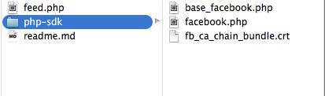

# Flux Facebook Perso 
## Facebook developper

## Install SDK

```<?php

// include the facebook sdk
require_once('php-sdk/facebook.php');
 
// connect to app
$config = array();
$config['appId'] = 'APP_ID';
$config['secret'] = 'APP_SECRET';
$config['fileUpload'] = false; // optional
 
// instantiate
$facebook = new Facebook($config);

?>``` 